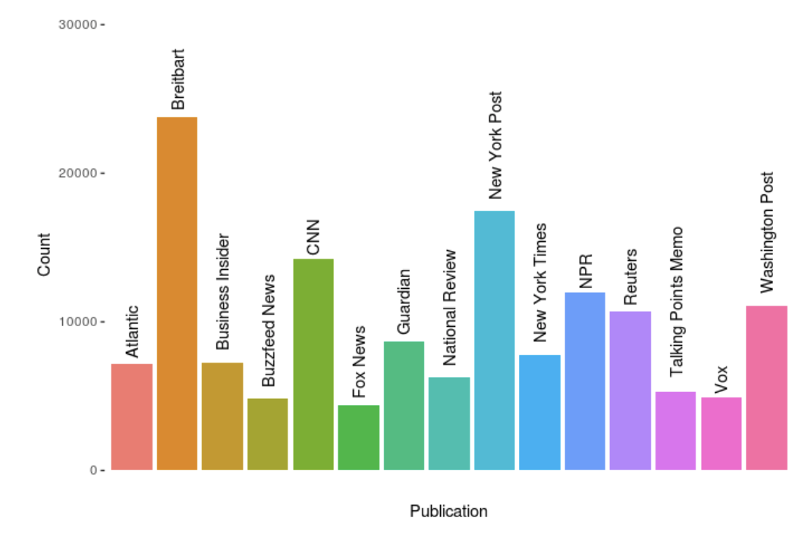
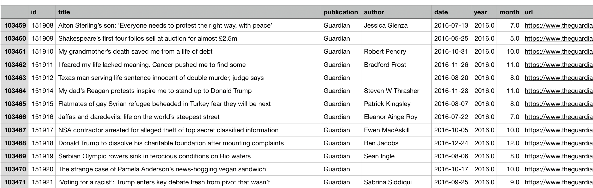
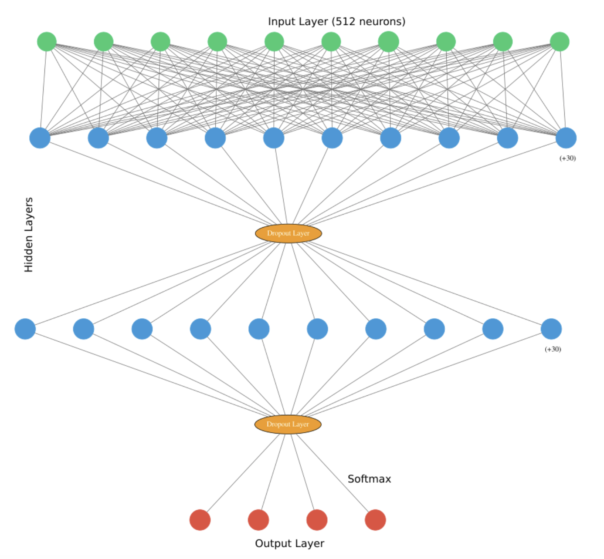

# Final Project Write-Up

### Project Poster:

 

## Introduction & Problem Statement

A current, popular theme throughout American politics is polarization. Much of the focus concerning polarization has been on different forms of polarization within either the political elites or the electorate. Yet, also during this time period there has been a spotlight placed on news and media outlets. News and media outlets have always had critics claiming their organization or publications have strong biases, but in the age of “Fake News” and “untruths” the significance and implications of these biases can be more drastic. An individual may be more like to distrust a news source that they believe to be biased, and instead turn to a news source they believe to be objective. While, on the surface this may appear to be a responsible way to proceed, in the context of a polarized society an individual must also note their own bias. Is a news article bias, or do they simply disagree with it? Is a news article objective, or do they simply agree with it? This can damage the flow of correct information when an individual rejects critical facts from the very beginning just because they believe the source to be biased. 

In this context, the foundational question must be raised, how biased are various news and media outlets?

## Data

Source- All the News on Kaggle by Andrew Thompson

Consists of three CSV files:
- Articles1.csv = 0-50,000 articles (50,000 articles)
- Articles2.csv = 50,001-100,000 articles (49,999 articles)
- Articles3.csv = 100,001-146,032 articles (46,031 articles)

Features: 9 Columns- ID, Title, Publisher, Author, Date, Year, Month, URL, Content

Publications: New York Times, Breitbart, CNN, Business Insider, the Atlantic, Fox News, Talking Points Memo, Buzzfeed News, National Review, New York Post, the Guardian, NPR, Reuters, Vox, and the Washington Post

Context: The articles were published between the years 2015 and 2017 with most of them being 2016 or 2017. There is not an equal amount of articles per publication 
- Top 5: Breitbart, New York Post, CNN, NPR, and Washington Post (Descending order based on quantity)

Application: For the purposes of the model only the third column (publisher) and nineth column (content) should be used.     

## Thoughts and Reflections Concerning the Data:

Articles were gathered based on their placement on website. An example of this was that the articles gathered from CNN were not all of the articles published within the CNN domain, but just the articles published on the CNN homepage. The articles gathered were the ones most prominently published by the outlets. This absolutely contributed to the difference in the quantity of articles gathered between the outlets, because some outlets publish more articles on their homepages relative to other outlets. Additionally, some outlets have a higher turnover in their homepage articles compared to other outlets.

Also, I feel like I was super lucky with the dataset I was able to find. Working with 146,032 observations was a bit overwhelming at the beginning, but it was a very welcomed burden considering the alternative of not having enough data. Then, considering the dataset has a total of 9 features/variables/columns and I only used two of them, I feel like I could do a lot more using the dataset maybe something looking at the date to evaluate bias over a period of time or a comparative look between different years. Even using the "author" feature to go from a macro-perspective with the outlets to a very micro-perspective looking at specific biases of authors and how the authors' biases have evolved overtime.

### Graph showing the different number of articles in the dataset based on publisher.

 

### Image of one of the CSV files containing the dataset.

## Method

1. I assigned the publishers either a Left or a Right Bias (based on mediabiasfactcheck.com). Next, I selected one Left biased publisher, CNN, one Left-Center biased publisher, NPR, one Right-Center biased publisher, New York Post, and one Right biased publisher, Breitbart. 

2. I filtered the data that only came from those publications and created an array with only the content of those articles. Then I removed all of the names of the publishers from the content.

3. I created two arrays, one for the publisher classifier (used to identify the publisher of the content) and a bias classifier (used to identify the bias of the content).

4. I change the stories so that they can be understood by the model/network. I used the universal-sentence-encoder so that the text would be transformed into 512 dimensional vectors.

5. When building the model I used an input layer with 512 neurons, two DNNClassifier layers (Hidden Layers) with 40 neurons each, two Dropout Layers with a dropout of .2 each, and I used the a Softmax activation function in the Output Layer. For the publisher classifier the output layer needs to have 4 neurons, and for the bias classifier it should have 2 neurons.

6. Then I split the data into training and test sets using StratifiedShuffleSplit and trained the classifiers.         

## Thoughts and Reflections Concerning the Method:

When looking at what model to use I knew I wanted to take the approach of using a Classifier. From there I did more research on whether I should use DNN or CNN. I did not know if CNN was just used for images or if one just worked better for text than the other. I settled on DNN fairly quickly, but a surprise alternative classifier that I found out about was the BERT Classifier. The BERT Classifier looked really interesting and could have potentially worked, but I still do not know a lot about it so I decided to stick with the DNN Classifier.

There was a completely different approach that someone else used when also looking at media bias that involved using LSTM layers. I had already settled on and starting using the DNN Classifier, but I do think it was cool how there were multiple ways to address the same topic. Comparing the results from the two  different approachs would be interesting.

This project also allowed me to get more comfortable and familiar with using the Adagrad Optimizer which was benefical. Another optimizer that could have been used and might have been better would be the Proximal Adagrad Optimizer. 

### Visualization of DNN Model Used (specifically for the publisher classification- 4 neurons in Output Layer)

## Results

Study 1: Detection of Bias in Media Outlets with Statistical Learning Methods by Blaz Fortuna, Carolina Galleguillos, and Nello Cristianini 

Looked at pairs of articles published by different media outlets covering the same event to determine if there was a way to identify vocabulary bias.

- Findings- Were able to identify the media outlet of an article at a high accuracy. Then identified words that played a significant role in their biased vocabulary which set them apart from the other media outlet. 

Study 2: Bias in Cable News by Greg Martin and Ali Yurukoglu

Used the transcripts from various cable news outlets and compared them to language used by congressmembers and the measure of that congressmembers ideology.

- Findings-  They were able to show that the cable outlets have become more polarized by using language that implies a specific connotation.

## Thoughts and Reflections on the Results

I selected these two studies because the two of them combined did a really great job of covering and looking at the two different aspects and classifiers I was using: media outlet classification and bias classification. This section was also the most frustrating for me, because of the power outage and complete loss of online connection. The last two days I really wanted to dive into my results and adjust my model accordingly, but sometimes life has different plans that happen to involve tropical storms. The storm also managed to break the front (and only) door to my apartment open (not a fun way to be woken up at 4am), so all things considered I am truly thankful it was not worse.

## Future Plan & Project Proposal

My ideal results would be able to show that the outlets can be clearly distinguished from each other. Relative to the bias classifier, I do not want to say that my results show that each media outlet has a clear bias, because that would not be the goal. I would just want to be able to indicate accurately how bias the outlets are and in what direction (Liberal/Conservative).

A really exciting aspect of this project and topic was that there is absolutely no shortage of opportunities for how it could be expanded upon. The topic is only going to become more relevant in today's society and context. While the quantity of data is going to continue to increase and become more diverse. The prospect of looking at media bias overtime would be an element that I would like to explore. Using the sixth feature/column (Year) or even a comparative study comparing the bias of an outlet during an election year versus their bias during a non-election year. Also, the ability to use the fourth feature/column to make the study look at specific authors' biases overtime or even if they worked at different outlets how had their biases compare to each other when working for one outlet compared to the other. A key aspect that I would have liked to adjust and would adjust for future approaches would be to make sure that the number of news articles that the model is being trained on is equal for each outlet.

