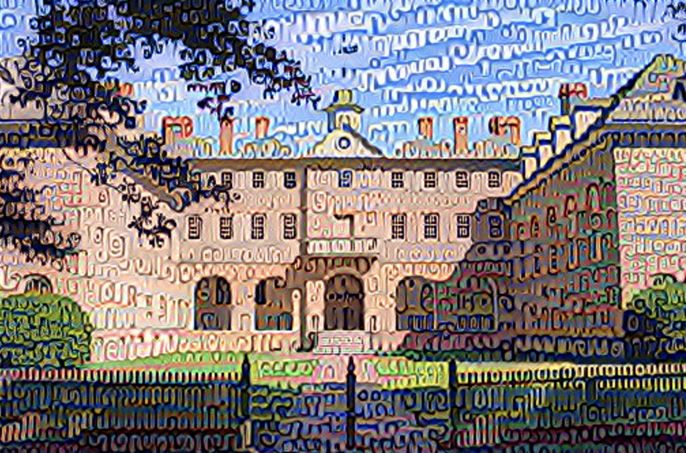
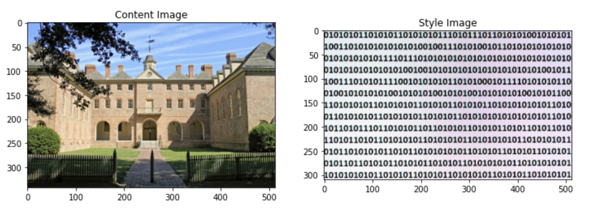
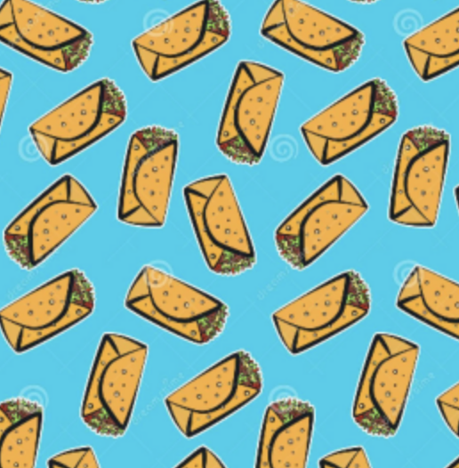
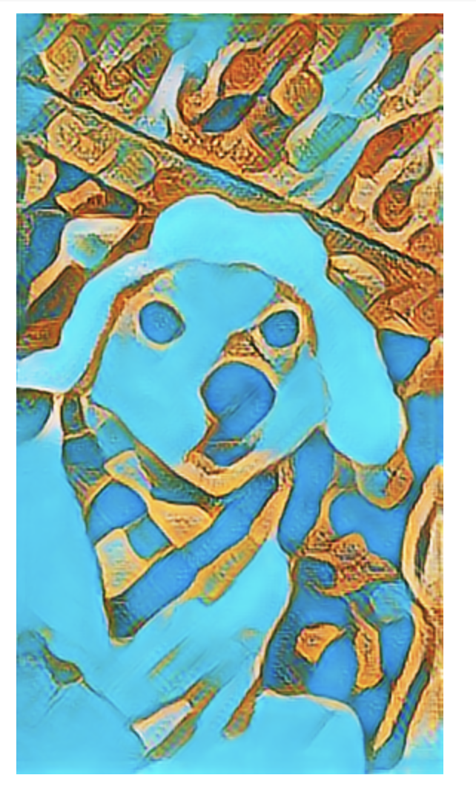

# Shirt Design

## Draft Design
For my draft design I decided to have my content image be of Wren since it is one of the most recognizable buildings on campus. Also, I have unintentionally had class in every academic building but Wren has been my favorite. Then for the style image I used a stock image of binary code since we are in the Jump Start for Data Science Program.

## Content Image and Style Image

[Source for content image](https://www.wm.edu/about/visiting/campusmap/location/photos/171.jpg)

[Source for style image](https://technologymoon.com/wp-content/uploads/2020/02/Canva-Binary-code.jpg)

### Nugget-Burrito Image

Style Image

Content Image

## Final Image

