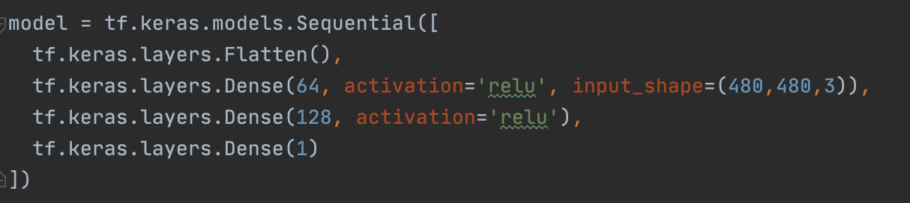
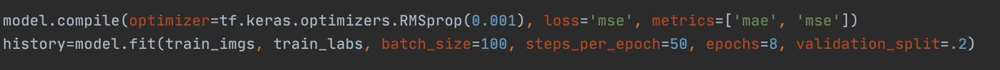
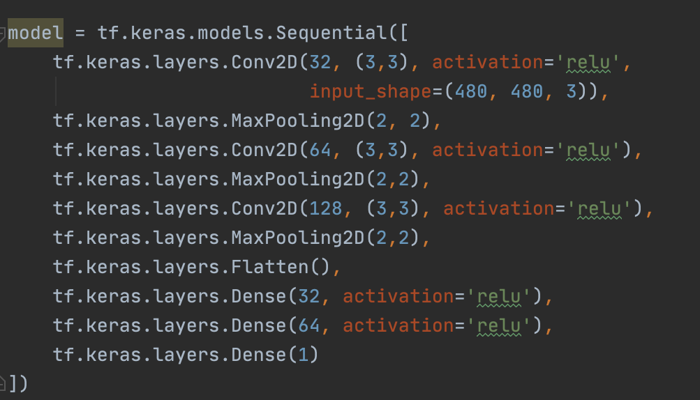
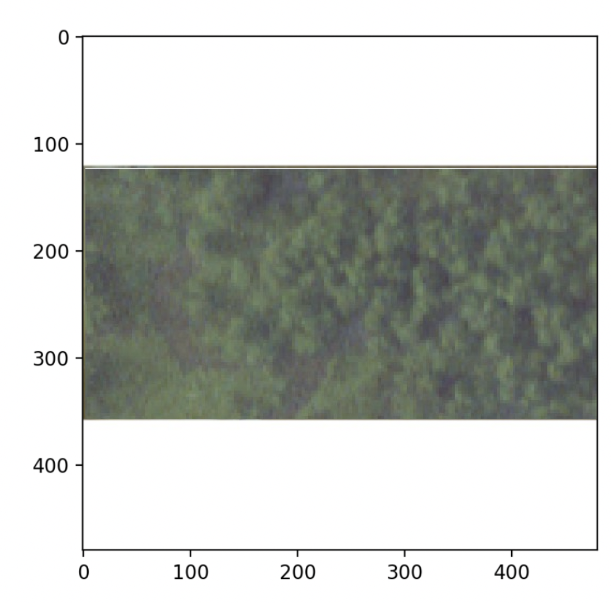
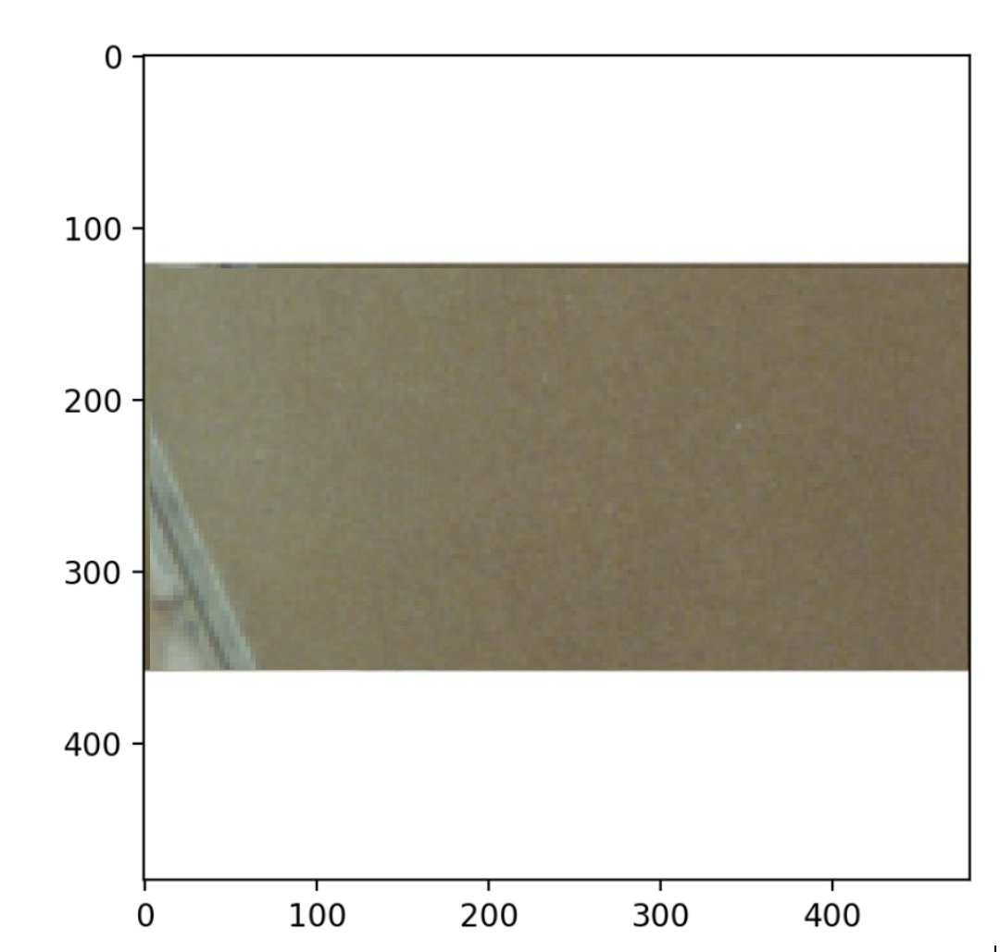
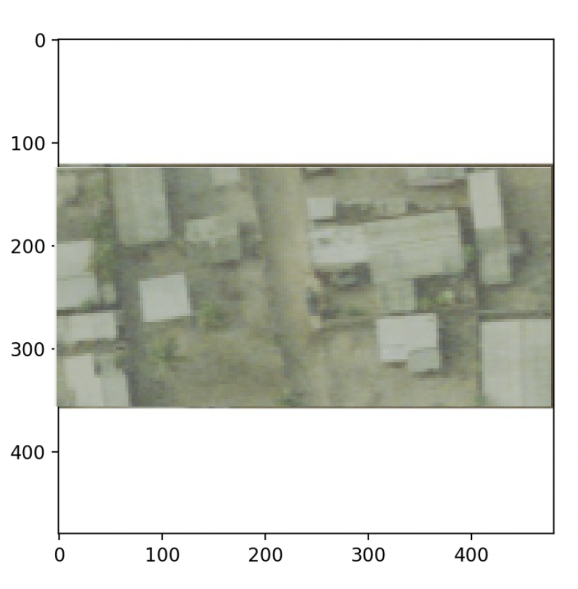

# Write-Up on Project 3

There were lots of obstacles with this project, but the hints and sources on the internet quickly became my best friends. First, I struggled with getting the images loaded into my model. After doing so research on the I tried using Image.open() but from what I could tell it would mess-up the order of the files. It would be completely useless to get the images and the labels uploaded if they did not even match each other and I tried to train my model with wrong information; however, the hint for uploading the files came just in time. I redid the structure of my file concerning the training and testing images. Now I had the first three Accra files were all in a folder named train_images and the fourth Accra file was in a folder named test_images. The new code kept the images matched with the correct labels, so I just used that. 

Next, I tried to standardize my data; however, I got an error that said that my computer did not have enough space. I did not want to delete or remove anything from my computer, and I did not know of a different way to fix the problem. I ended up not standardizing the data by dividing by 255 which is definitely something that I would change if I was on a different computer/set-up. 

I created a small DNN model as suggested just to make sure that everything was okay. Using a Sequential model with the first layer that included a flatten layer, a dense layer with 32 neurons, another dense layer with 64 neurons, and then the last dense layer with 1 neuron. I used Relu as my activation because in the past we have used ReLu on other larger datasets. I believe that this is because ReLu is the best at handling the vanishing gradient problem. When I compiled the model, I used a Adam Optimizer and sparse_categorical_crossentropy as my loss function. I selected Adam and sparse_categorical_crossentropy out of comfort and familiarity not effectiveness concerning the application, which became painfully clear. At this point I thought I had just completely messed everything up and was very confused on where to even go from there. When looking at my model and trying to figure out where it all went wrong, I realized that did not have a good reason for using the Adam, sparse_categorical_crossentropy, or even my metric of accuracy. From there I hit the internet to try and understand whether or not the aspects in model were actually the appropriate ones to use. Quickly, I realized that they were absolutely not the correct functions to use. I switched from the Adam to the RMSprop optimizer which works way better with larger datasets and has a moving average. Then I changed sparse_categorical_crossentropy to MSE, because sparse_categorical_crossentropy is used as a probabilistic loss which is not at all what I needed. I selected MSE because it is the most used loss function when looking at regression problems and it would best handle outlier predictions. Then I changed the metric to correctly reflect what and how I was evaluating the data. I changed the accuracy to MAE and MSE instead. 

At this point I had more confidence and understanding in what I was actually doing and what I wanted my model to achieve. I decided to redo another DNN model this time I increased the number of neurons in the middle two dense layers to 64 and 128, and this time I used the correct loss, optimizer, and metrics. I fit the model using the training images and the training labels (100 epochs, 50 steps per epoch, 150 batch size). The results were 48.2091 for MAE and 2566.0535 for MSE. Then I evaluated the model using the test images and testing labels. The MAE was 60.3257 and the MSE was 3101.6791. Considering it took a solid amount of time to run the DNN model I decided to move onto creating a CNN model.

DNN Model used:

The CNN model consisted of 3 Conv2D layers (32, 64, 128 neurons), 3 MaxPooling layers, one Flatten layer, and 3 Dense layers (32, 64, 1 neuron). I compiled the function with the RMSprop optimizer and a learning rate of 0.001. When I tried to fit my model with fitting that I used for the DNN (100 epochs, 50 steps per epoch, 150 batch size), my computer did not like that and started to get very hot and sounded like it was running a marathon. I got a little nervous, so I stopped it and changed the fit to 8 epochs, 50 steps per epoch, and 100 batch size. The model was running a little faster and I think running less epochs also could have helped with the problem of overfitting that was present in the DNN model.

CNN Compile and Fit used:

When I randomly selected the three images and used the same set-up from the latest CNN model. When I fit the model this time, I was still slightly nervous about crashing my computer, so I lowered it again to 5 epochs, 10 steps per epoch, and 100 batch size.

CNN Model used:

## Random Image 1 (Index 120):

- Predicted Population: 5.6008731

- Actual Population: 9.23079299926758

## Random Image 2 (Index 183):

- Predicted Population: 8.7326854

- Actual Population: 37.5414886474609

## Random Image 3 (Index 4019):

- Predicted Population: 20.6559321

- Actual Population: 36.320446014403

The results show that the model does a better job at predicting rural areas than urban areas. A reason why the first image might have been so off was because of the significant tree cover present in the image. When looking at the third random image the model does not do well maybe because height of the building is not able to be taken into account, the number of floors in a building can greatly impact the number of people capable of living there.   

This project absolutely helped me better understand which loss, activation, optimizer, and metrics to use. When I hit the first really big wall it was pretty daunting, and I just completely lost confidence in all of my code, data, and understanding of the topic; however, I was able to breakdown the problem and work through it one piece at a time which allowed me to come to the conclusion that the problem was completely manageable and I was just psyching myself out for the most part. Also, this really helped me become more aware of not only the various features of the model itself, but also the resources online that help describe the different types of features. While the project was difficult, I feel like it had necessary, manageable obstacles that once I was able to figure out, I gained more confidence overall in my understanding and ability to execute.     

