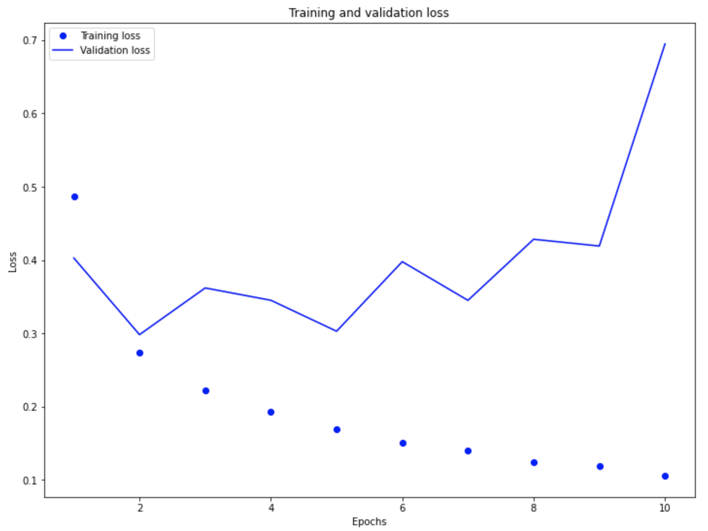
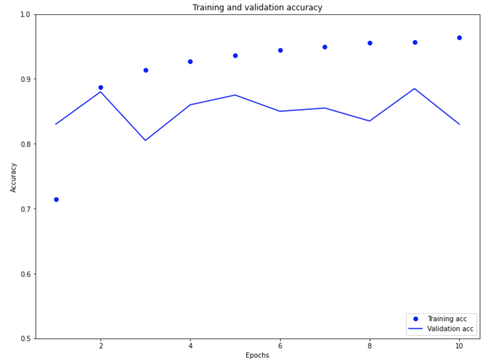
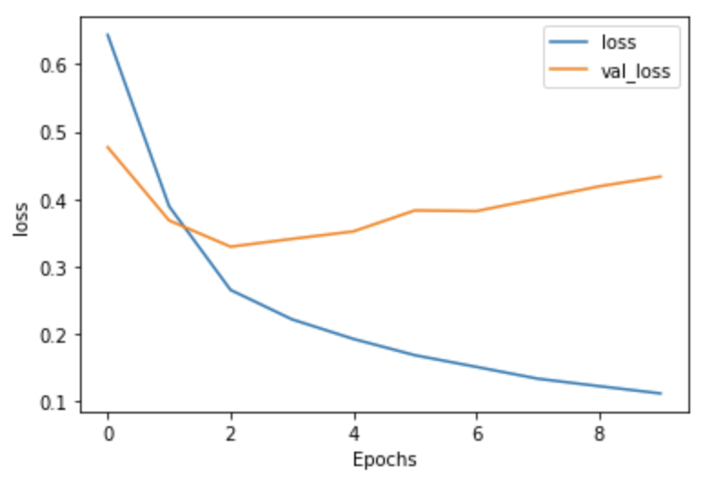
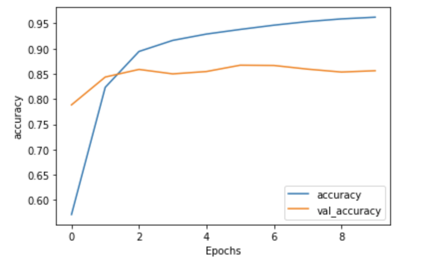
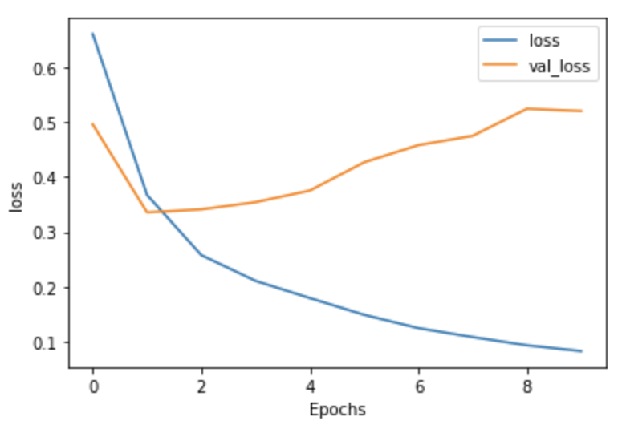
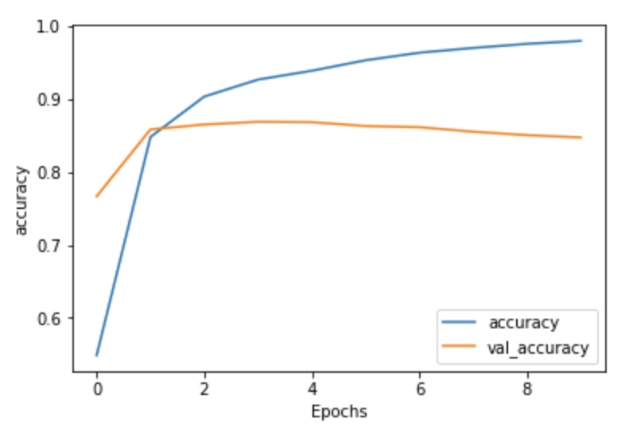

# Response for Class on 7/28

## Word Embeddings

## Question 1: Why is using one-hot encoding an inefficient towards vectorizing a corpus of words? How are word embeddings different?

### Answer:
  One-hot encoding involves creating a vector that contains the vocabulary. In order to represent each word a zero vector is created that is the length of the vocabulary with a one in the index that corresponds to the word. One-hot encoding is inefficient because it populates the vector with far more zeros than ones, meaning the vast majority of values in the vector are zero making it sparse. The formula that I think shows the percentage of zeros present in a vector was the absolute value of |(1/x) – 1|. Looking at this it is clear that by significantly increasing x or the number of words in a vocabulary, you will greatly increase the number of zeros. For example, in a vocab that has 10,000 words, by adding one more word to make it 10,001 words you are also adding 10,000 more zeros to our vector because the length of the vector is equal to the length of the vocab. Instead of using solely 1’s and 0’s word embeddings use dense vectors with floating point values which enables similar words to have similar encoding. Personally, I feel like a user has a lot more control over word embeddings than they do one-hot encoding because the length of the vector is a parameter that the user specifies (not the vocab length) and the values are learned during training according to parameters also specified by the user. This makes word-embedding much more usable with larger datasets than one-hot encoding.
  
## Question 2: Compile and train the model from the tensorflow exercise. Plot the training and validation loss as well as accuracy. Post your plots and describe them.

### Answer:

Validation loss decreases for the first epochs but then by the second epoch the validation loss continues to increase and decrease about every other epoch until the nineth epoch in which it increases drastically. This is contrast to the training loss shows a consistant decrease.

Similar to the validation loss, the validation accuracy reaches it most optimal point at around two epochs. After the second epochs the validation accuracy goes through a series of increases and decreases, yet is never able to reach a higher accuracy than it did on the second epoch. In contrast the training accuracy shows a consistent improvement in accuracy reaching 99%

When looking at both the training/validation loss and accuracy graphs it becomes clear that the model is overfit.

## Text Classification with an RNN

## Question 1: Again compile and train the model from the tensorflow exercise. Plot the training and validation loss as well as accuracy. Stack two or more LSTM layers in your model. Post your plots and describe them.

### Answer:

### With two-layers of LSTM:

Loss with 2 LSTM Layers-

Accuracy with 2 LSTM Layers-

Honestly, I expected to see a larger difference concerning accuracy and loss between the model without the two LSTM layers and the model with the two LSTM layers. For the most part they have the same shape, but the 2 LSTM layer model does show slight improvement with accuracy; however, it does worse with the loss. I would maybe add more LSTM layers and run it to see if it improves or would just make it worse. Regardless, both models are overfit.  

