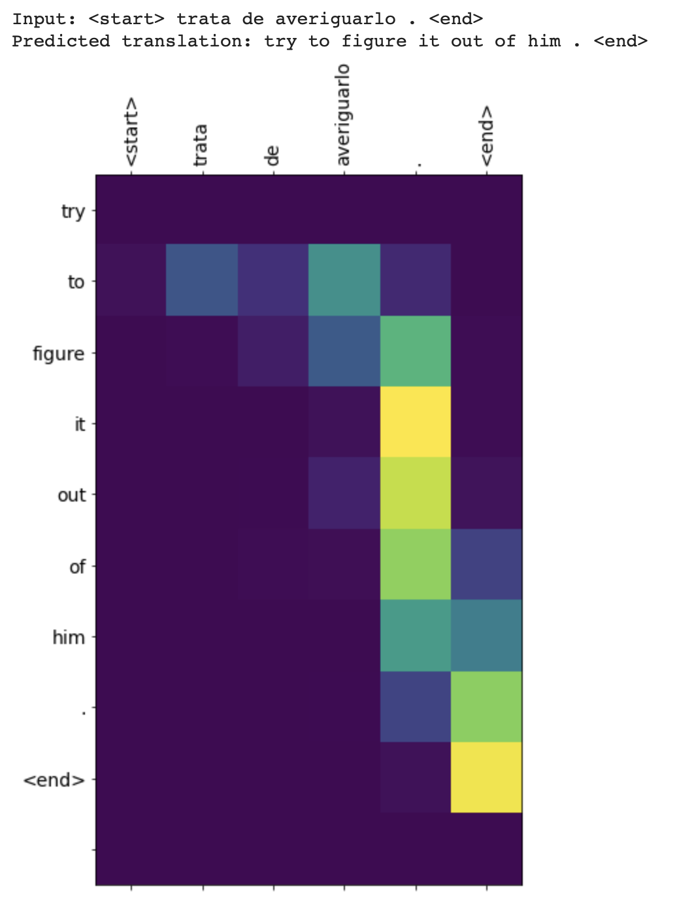
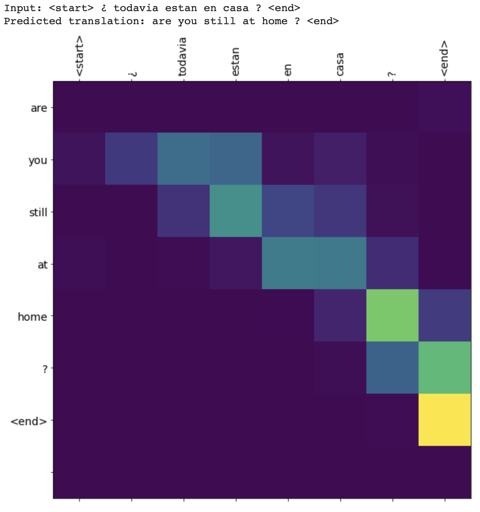
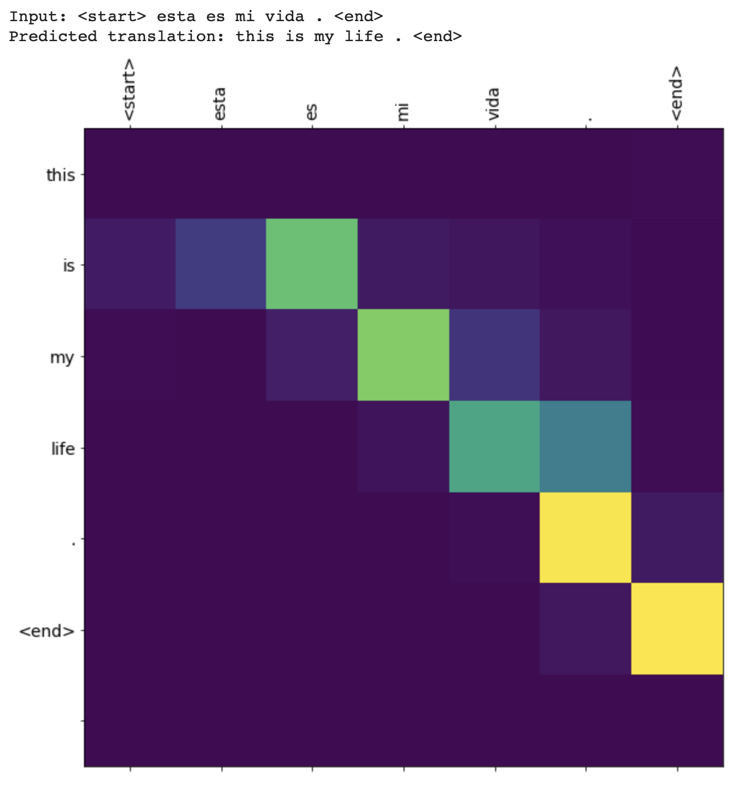

# Response for Class on 7/29

## Using NLP to build a sarcasm classifier

## Question 1: Pick two or three news sources and select a few news titles from their feed (about 5 is likely enough). For example you could select CNN, Fox News, MSNBC, NPR, PBS, Al Jazeera, RT (Russia Today), Deutsche Welle, Facebook, BBC, France24, CCTV, NHK World or another source you wish you analyze. Run your sarcasm model to predict whether the titles are interpreted as sarcastic or not. Analyze the results and comment on the different news sources you have selected.

### Answer: 

### Articles Selected and Sarcasm Prediction-

CNN:

"Trump must win North Carolina. He's losing there."
- Sarcasm value: 3.6376020e-06 (Is not sarcastic)

"Biden clarifies he has not taken cognitive test"
- Sarcasm value: 9.9956447e-01 (Is sarcastic)

NPR:

"Americans Back Trump On Immigration — But Only To Stop COVID-19, Poll Finds" 
- Sarcasm value: 2.9829248e-09 (Is not sarcastic)

"Airline Food For Sale. No Plane Ticket Required"
- Sarcasm value: 9.0619403e-01 (Is sarcastic)

"When Oil Prices Plummeted, So Did Oklahoma's State Budget"
- Sarcasm value: 9.4740230e-01 (Is sarcastic)

When providing the numerical value to the titles the model is predicting whether or not the title is sarcastic. The closer a title is to 1 the more likely the article title is sarcastic. Inversely, the closer the title is to 0 the more likely the title is not sarcastic. The model did a better job than I thought it would. Honestly, with the state of everything in the world I sometimes have a hard time telling if a title is sarcastic or not, so I thought the model did well. The only article that I believe the model got incorrect was the second article title it classified as sarcastic, but based on the tone of the article, itself, I do not think it is. However, 10 years go in the world of politics the need to know and specific whether or not a party candidate for the Presidency would have come across as so unnecessary that it would sarcastic, so I do understand the mistake on the model’s part.

## Text generation with an RNN

## Question 1: Use the generate_text() command at the end of the exercise to produce synthetic
output from your RNN model. Run it a second time and review the output. How has your RNN model been able to “learn” and “remember” the shakespeare text in order to reproduce a similar output?

## Answer:

Generated Shakespear Text:
- ROMEO: pray you at thy heart;
Melty inswell'd watch'd him, he: I will but my remorries
And my ears unto a his fond turnd dull thousands?
Here's me not from my fortunes afflimed,
Becomething wherein Clifford sends or hate
To meet the heavens dared upon my dearly:
Or say 'Tis death; and so your children, can with clobkeds home
Drown inherion stars out of retre married?

- GLOUCESTER:
Got with thy lightning-sels,
Take there!

- CLAUDIO:
I know he comeseth never can Clook,
To Nandant:
Sir, you are quite lays force: after his fearniods which find
Kind bewny. Show them still and wind-ninger,
Unbere's too! O, forget to buy me;
It can mistressor, may made what only didst it should she yield his warrant,
Nevirring A fres hour and doling, and have the county.
The mightness, Ox crafting,
Laster towle! Held him as truth as singlerable.

- GREMIO:
Now, you hear o'erleased, Droppest! many marrying is crown
Out of his body bound a furror of the sea:
s your wisdom, mother, Edward, doubt it.

- KATHARINA:
Now, is my

RNN models are able to learn the sequences of the letters/strings and then generate new plausible sequences for the letters/strings. First the model is able to have the strings represented by numerical values. Then it takes the first string/letter specified and will predicted/generate the next string/letter based on the learned sequence from the provided text the model. 

### Stretch Goal: Harry Potter Generated Text

- Harry: Nobody 
Potions 
have y her uncomfortable — ” 

- “A-Wha’ll to it to 
perform Hermione’s hand, and he said, “A Quidditch party. I came adive to create a smathering ballikely behis very 
repelling down the myst beture. as Herbologe-(nose underneathen Ron 
seems during that Neville surfash was dazzling from 
underage, to be still; Hermione cried Harry short, Riddle made Minister than Harry fell bands about the 
right both himself, but he need and sinking 
out at the Prime Minister. “There is 
not to manage ... saying. “If it might be the Head later!” 

- “How do you know ehe? I make them all these year, didn’t!” 

- “I always you need to have you?” 

- and she did not find herself, “Ha’s, I think so.” 

- “I cannot pretty me zoupappold so the Pensieves did not need hold of us wisn’t some high and 
Dumbledore to N.E.W...0 st party into long 
when they were a particl me had finally 
had a very reaffeticed their first time he did not 
know what they could not taking about studing: It 
was as to ask t

The Harry Potter text for the most part does not make sense and has words that do not even exist; however, an aspect that really surprised me was that when predicting dialogue between characters it was able to still get across the attitude of the characters that they have towards each other. The model should definitely be run for more epochs and probably have the model layers be adjusted a little. 

## Neural machine translation with attention

## Question 1: Use the translate() command at the end of the exercise to translate three sentences
from Spanish to English. How did your translations turn out?

### Answer: 

It did not go very well, which makes sense to me. Throughout Arabic class at College it has always been painfully obvious when someone tries to use Google Translate for assignments, because it does not understand the aspects of the word that have to do with culture or even if you have words that can appear to mean the same thing but they are used in different contexts.

