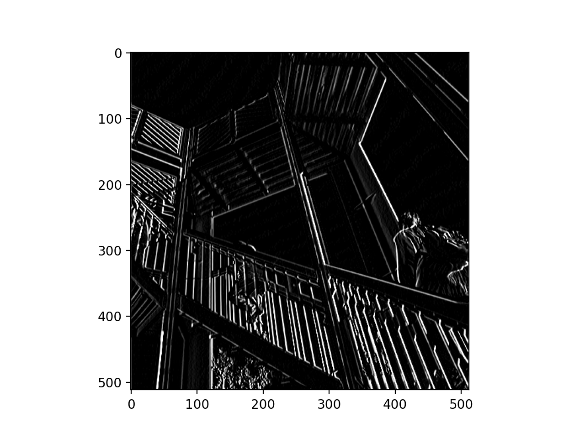

# Response for Class on 7/14

## Question 1:
### Last week you did an exercise where you manually applied a 3x3 array as a filter to an image of two people ascending an outdoor staircase.  Modify the existing filter and if needed the associated weight in order to apply your new filters to the image 3 times.  Plot each result, upload them to your response, and describe how each filter transformed the existing image as it convolved through the original array and reduced the object size.  What are you functionally accomplishing as you apply the filter to your original array (see the following snippet for reference)?  Why is the application of a convolving filter to an image useful for computer vision?  Stretch goal: instead of using the misc.ascent() image from scipy, can you apply three filters and weights to your own selected image?  Again describe the results.

### Answer:
  1-	By creating the convolution, we are able to isolate specific aspects of the image. For this picture example we are isolating sharp edges and straight lines, meaning the convolution will only pass through the sharp edges and straight lines.
  
  
  The first image is of the original picture. 
  
  
  This second image emphasizes the horizontal lines. This is clear when looking at the top left of the picture.
  
  
  The third image emphasizes the vertical lines.
  
## Question 2:
### Last week you did an exercise where you manually applied a 3x3 array as a filter to an image of two people ascending an outdoor staircase.  Modify the existing filter and if needed the associated weight in order to apply your new filters to the image 3 times.  Plot each result, upload them to your response, and describe how each filter transformed the existing image as it convolved through the original array and reduced the object size.  What are you functionally accomplishing as you apply the filter to your original array (see the following snippet for reference)?  Why is the application of a convolving filter to an image useful for computer vision?  Stretch goal: instead of using the misc.ascent() image from scipy, can you apply three filters and weights to your own selected image?  Again describe the results.B.Another useful method is pooling.  Apply a 2x2 filter to one of your convolved images, and plot the result.  In effect what have you accomplished by applying this filter?  Can you determine from the code which type of pooling filter is applied, and the method for selecting a pixel value (see the following snippet)?  Did the result increase in size or decrease?  Why would this method be method? 

### Answer:
  Pooling is able to reduce the amount of information within the image but still maintain the features that can be identified. For this example, the size of the image 512 pixels; however, now the pooling and specified code of ‘new_x = int(size_x/2)’ and ‘new_y = int(size_y/2)’ reduced the image down to 256 pixels. We are using max pooling so that convolution will look at the pixels and their immediate neighbors, then it will take the largest and transfer it to a new image. Therefore, the image will only be ¼ of the original size.
  
  
## Question 3:
### The lecture for today (Coding with Convolutional Neural Network) compared the application of our previously specified deep neural network with a newly specified convolutional neural network.  Instead of using the fashion_MNIST dataset, use the mnist dataset (the hand written letters) to train and compare your DNN and CNN output.      Were you able to improve your model by adding the Conv2D and MaxPooling2D layers to your neural network?  Plot the convolutions graphically, include them in your response and describe them.  Edit the convolutions be changing the 32s to either 16 or 64 and describe what impact this had on accuracy and training time.  What happens if you add more convolution layers?

### Answer:
  The CNN performed better, because it was better able to recognize the features when adding the convolution layers. By adding more convolution layers the accuracy was able to improve but it also caused the run time to take longer since the data had to be processed through additional filters. When using the callback end_epochs function, I ran the code through two layers of convolution and max pooling. 

  
  When both layers were set to 32 filters, the accuracy was 99.1%.
  
  
  Then for when the layers were set to 64 and 16 filters the accuracy was 98.78%.
  
  
  When the layers were 64 and 32 the accuracy was 98.83%.
