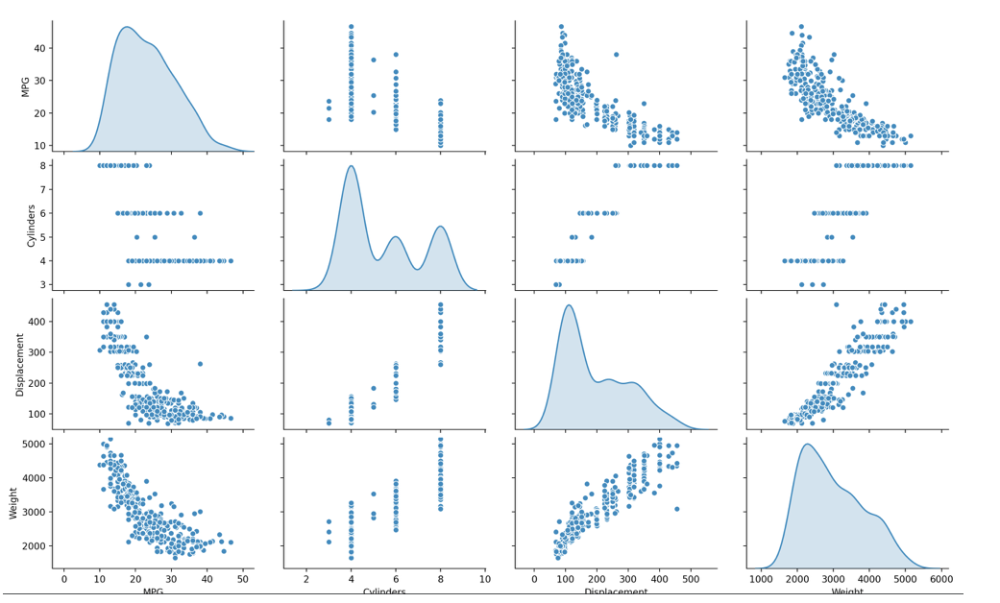
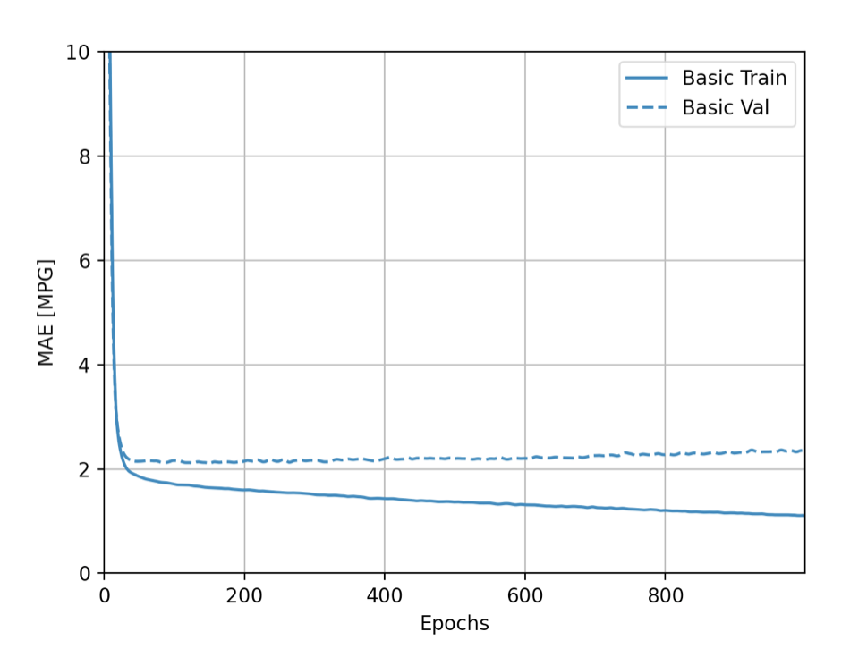
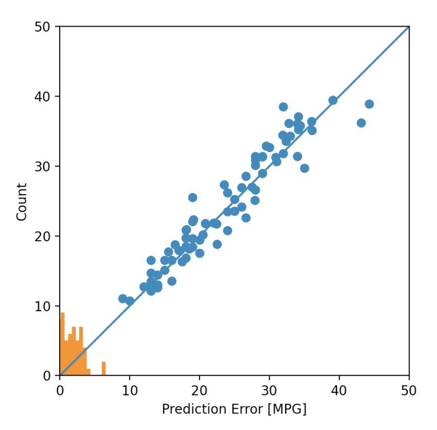

# Response for Class on 7/15

## Question 1: Describe the ImageDataGenerator() command and its associated argument.  What objects and arguments do you need to specify in order to flow from the directory to the generated object?  What is the significance of specifying the target_size = as it relates to your source images of varying sizes? What considerations might you reference when programming the class mode = argument?  How difference exists when applying the ImageDataGenerator() and .flow_from_directory() commands to the training and test datasets?

### Answer:
  The data generators are able to read pictures located in the specified source folders. Then the generators convert the images into tensors that allows them to be ran through the network along with their label. Two generators are set up separately, one for training and one for testing, so that the training generator can pull, read, feed through images and their labels that the model is trained on. Those images are completely separate from the images that are then pulled by the testing generator (without their label) from the testing directory which the network has never seen before. The ImageDataGenerator command/class is what allows you to access the images. In order to flow to the object, you want you must specify the source directory. Then since some of the pictures might be different sizes target_size allows you to resize all of the images to the same specified size. When looking at the class_mode you want to take into consideration the type of loss function you are using and also the loss function and the class_mode should be dependent on the number of classes. If you have only two classes than the class_mode should be binary but if you have more than two classes than it should be categorical.
  
## Question 2: Describe the model architecture of the horses and humans CNN as you have specified it.  Did you modify the number of filters in your Conv2D layers?  How do image sizes decrease as they are passed from each of your Conv2D layers to your MaxPooling2D layer and on to the next iteration?  Finally, which activation function have you selected for your output layer?  What is the significance of this argument’s function within the context of your CNN’s prediction of whether an image is a horse or a human?  What functions have you used in the arguments of your model compiler?

### Answer:
  My model I have decided to have two Conv2D layers and two MaxPooling2D layers with one flatten layer and two dense layers. Since we are looking at a binary classification problem, I will use the sigmoid activation so that the output of the network which will encode the images as either 0 or 1, meaning identifying them as either class 0 or class 1. I set the first Conv2D layer to have 32 filters and then the second Conv2D layer to have 64 filters. The image starts as 300 by 300 but then losses a pixel border to become 298 by 298 then gets halved in each dimension by the Pooling layer so it becomes 149 by 149, and losses another pixel border making it 147 by 147 in the second Conv2D layer. As it reaches the final Pooling layer it is again cut in half making it 73 by 73. The model had 174,641,089 total params. In the model compiler I used the binary_crossentropy loss function and the RMSprop optimizer function.   

## Question 3: Using the auto-mpg dataset (auto-mpg.data), upload the image where you used the seaborn library to pairwise plot the four variables specified in your model.  Describe how you could use this plot to investigate the co-relationship amongst each of your variables.  Are you able to identify interactions amongst variables with this plot?  What does the diagonal access represent?  Explain what this function is describing with regarding to each of the variables.

### Answer:
  A pairwise plot helps anyone trying to understand the data figure out which features/variables best explain a relationship present in the model. The plot does this by pairing all of the variables to each other. The collection of scatter plots represents the relationship between two different variables while along the diagonal the density plots shows the distribution of each category of each continuous feature/variable. In the pairwise plot below, there appears to be a positive relationship between weight and displacement that as weight increases, displacement also increases. Additionally, there appears to be an inverse relationship between MPG and displacement along with weight; meaning as weight or displacement increase the MPG decreases.
  

## Question 4: After running model.fit() on the auto-mpg.data data object, you returned the hist.tail() from the dataset where the training loss, MAE & MSE were recorded as well as those same variables for the validating dataset.  What interpretation can you offer when considering these last 5 observations from the model output?  Does the model continue to improve even during each of these last 5 steps?  Can you include a plot to illustrate your answer?  Stretch goal: include and describe the final plot that illustrates the trend of true values to predicted values as overlayed upon the histogram of prediction error. 

### Answer:
  For this car dataset, as the epochs increase the validation and accuracy of the model decrease. The high number of epochs cause the model to become overfit. The model being over trained on the training data (way too many epochs) causing the model to become too specific towards the training data and not generalized enough to be accurate on unseen data. It even appears to lose validation with the training data itself.
    
