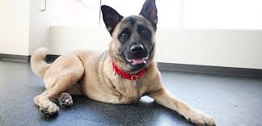

# Response for Class on 7/20

## Problem Statement

### Introduction:
A current, popular theme throughout American politics is polarization. Much of the focus concerning polarization has been on different forms of polarization within either the political elites or the electorate. Yet, also during this time period there has been a spotlight placed on news and media outlets. News and media outlets have always had critics claiming their organization or publications have strong biases, but in the age of “Fake News” and “untruths” the significance and implications of these biases can be more drastic. An individual may be more like to distrust a news source that they believe to be biased, and instead turn to a news source they believe to be objective. While, on the surface this may appear to be a responsible way to proceed, in the context of a polarized society an individual must also note their own bias. Is a news article bias, or do they simply disagree with it? Is a news article objective, or do they simply agree with it? This can damage the flow of correct information when an individual rejects critical facts from the very beginning just because they believe the source to be biased. 

### Research Question:
In this context, the foundational question must be raised, how biased are various news and media outlets?

### Obstacles:
I am a little worried about finding a dataset that is large enough with many different actricle from various publishers. Also, this will probably consist a lot trial and error with figuring out what type of model and specific features to use. Hopefully, I can find a model to work base mine off.   

## Cats and Dog Classifier

## Question 1: Which optimizer have you selected, and how might it compare to other possible choices?

### Answer:
  For the cat vs. dog model the optimizer I used was RMSprop. RMSprop, root mean square prop, was selected over other optimizers because of its ability to keep adjusting the average of the squared gradients for each weight then dividing the gradient by the square root of the mean square. By using the moving average, the learning rate is able to be adapted. Additionally, RMSprop works better for larger datasets than other optimizers such as Rprop and Adam.
  
  [Source Link](https://towardsdatascience.com/understanding-rmsprop-faster-neural-network-learning-62e116fcf29a)
  
## Question 2: Describe your selected loss function and it’s implementation.  How is it effectively penalizing bad predictions?

### Answer:
  I used the binary cross-entropy loss function, because the classification is binary (cat or dog). The loss function penalizes bad predictions based on the prediction’s probability. In other words, if the probability between an image and its actual label is low (like .015) then the loss has to be large. However, if the probability between the image and the actual label is 1.0 or close to 1.0 then the loss has to be zero or close to zero.
  
  [Source Link](https://towardsdatascience.com/understanding-binary-cross-entropy-log-loss-a-visual-explanation-a3ac6025181a)
  
## Question 3: What is the purpose of the metric= argument in your model.compile() function?

### Answer:
  A metric function is used to determine how well a model is performing. There are different types of metrics depending on how someone would want to evaluate the performance of their model. 
  
  [Source Link](https://keras.io/api/metrics/)

## Question 4: Plot the accuracy and loss results for both the training and test datasets.  Include these in your response.  Assess the model and describe how good you think it performed.

### Answer: 
  The model performed okay, with that being said it is still clearly overfit. Between the 14th epoch and the 15th epoch the validation accuracy went from 0.8167 to 0.7913. Then looking at the graphs the loss validation goes up and down a couple of times, but especially around the 9th epoch.
  

## Question 5: Use the model to predict 3 dog images and 3 cat images.  Upload you images and the prediction.  How did your model perform in practice?  Do you have any ideas of how to improve the model’s performance?

### Answer:
  When I uploaded my 3 cat and 3 dog images it only misclassified one image. The model correctly identified all of the dog images. Then with the cat images it correctly labeled 2 images, including the one of Taylor Swift from the movie Cats, but it did mislabel the image of the cat dressed up in sunglasses and a bowtie. Considering the overfitting the model performed better than I thought it would with my images. I would run fewer epochs and probably adjust the learning rate.
  
  ### Cat Images
  
  ### Correctly Labeled
  
  
  
  
  
  ### Incorrectly Labeled
  
  
  
  ### Dog Images
  
  ### Correctly Labeled
  
  
  
  
  
  
  
  
  
  
