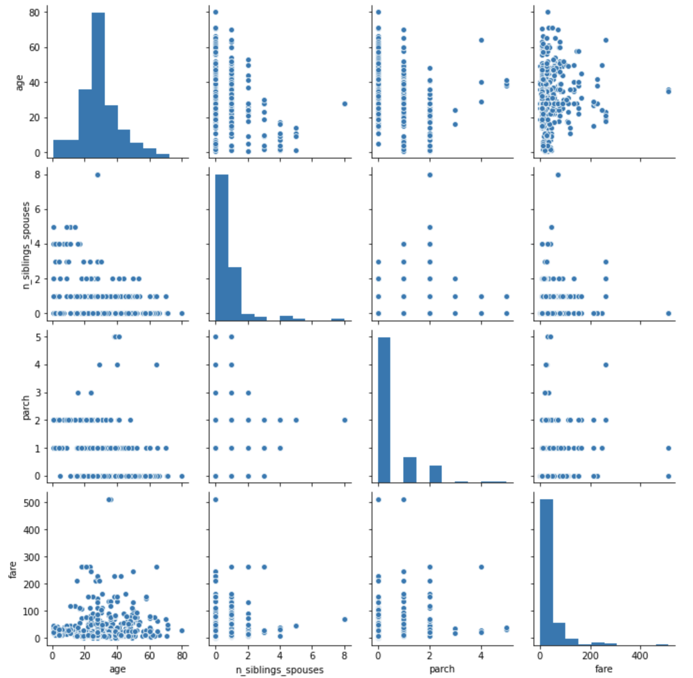
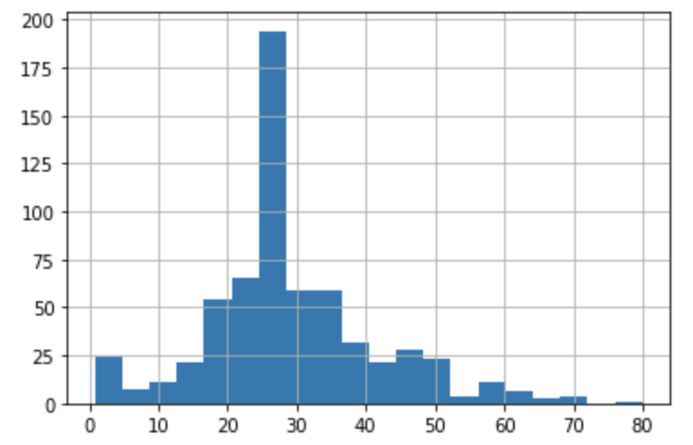
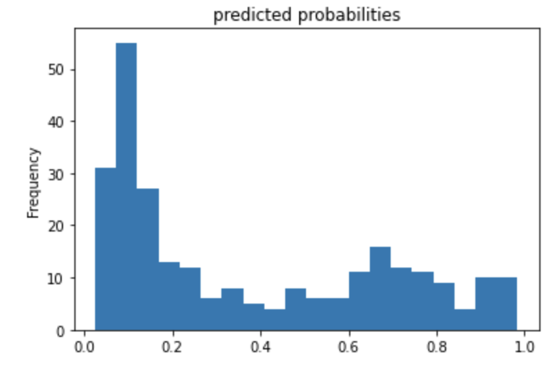
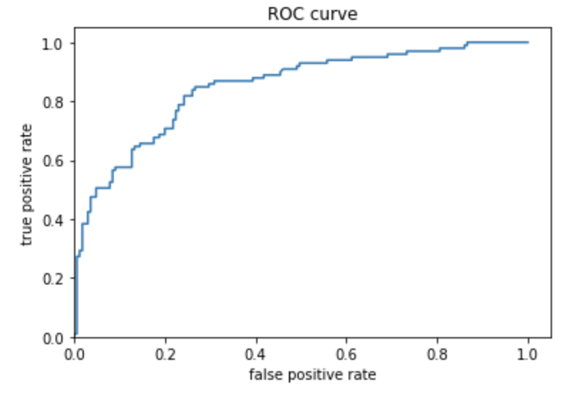

# Response for Class on 7/21

## Premade Estimators

## Question 1: How did you split the labels from the training set?  What was the name of the labels dataset?

### Answer:
  In order to remove the labels from the training set clearly identified the column names as sepal length, sepal width, petal length, petal width, and species. The species were either Setosa, Versicolor or Virginica. After using Keras and Pandas to download separate datasets for training and testing, we used the pop() function and specified it to remove the “Species” named column.
  
## Question 2: List 5 different estimators from tf.estimator and include the base command as you would write it in a script.

### Answer:

  ### tf.estimator.DNNClassifier( 
hidden_units, feature_columns, model_dir=None, n_classes=2, weight_column=None, label_vocabulary=None, optimizer='Adagrad', activation_fn=tf.nn.relu, dropout=None, config=None, warm_start_from=None, loss_reduction=losses_utils.ReductionV2.SUM_OVER_BATCH_SIZE, batch_norm=False) 

	- Used for deep models that perform multi-class classifications
  
  ### tf.estimator.DNNLinearCombinedClassifier(
model_dir=None, linear_feature_columns=None, linear_optimizer='Ftrl', dnn_feature_columns=None, dnn_optimizer='Adagrad', dnn_hidden_units=None, dnn_activation_fn=tf.nn.relu, dnn_dropout=None, n_classes=2, weight_column=None, label_vocabulary=None, config=None, warm_start_from=None, loss_reduction=losses_utils.ReductionV2.SUM_OVER_BATCH_SIZE, batch_norm=False, linear_sparse_combiner='sum')
  
  - Used for wide and deep models
  
  ### tf.estimator.LinearClassifier(
feature_columns, model_dir=None, n_classes=2, weight_column=None, label_vocabulary=None, optimizer='Ftrl', config=None, warm_start_from=None, loss_reduction=losses_utils.ReductionV2.SUM_OVER_BATCH_SIZE, sparse_combiner='sum')

  - Used for classifiers based on linear models
  
  ### tf.estimator.BoostedTreesClassifer(
label_vocabulary=None, n_trees=100, max_depth=6, learning_rate=0.1, l1_regularization=0.0, l2_regularization=0.0, tree_complexity=0.0, min_node_weight=0.0, config=None, center_bias=False, pruning_mode='none', quantile_sketch_epsilon=0.01, train_in_memory=False)
  
  - Used for Tensorflow Boosted Trees models
  
  ### tf.estimator.RunConfig(
model_dir=None, tf_random_seed=None, save_summary_steps=100, save_checkpoints_steps=_USE_DEFAULT, save_checkpoints_secs=_USE_DEFAULT, session_config=None, keep_checkpoint_max=5, keep_checkpoint_every_n_hours=10000, log_step_count_steps=100, train_distribute=None, device_fn=None, protocol=None, eval_distribute=None, experimental_distribute=None, experimental_max_worker_delay_secs=None, session_creation_timeout_secs=7200)
  
  - Used to specify the configurations for an Estimator run
  
## Question 3: What are the purposes input functions and defining feature columns?

### Answer:
  Creating input functions is what allows you to enter data into an estimator model. They return features which are a dictionary of feature names and numeric arrays and labels which are an array of values. By defining the feature column, the model is told how it should use the raw data from the features dictionary returned by the created input function.
  
## Question 4: Describe the command classifier.train() in detail.  What is the classifier and how did you define it?  Which nested function (and how have you defined it) are you applying to the training and test detests?

### Answer:
  The classifier.train() command trains the estimator model using the training dataset. The input function which is a nested function and was defined earlier puts the data into batches sizes of 256. Then the method is set to train for 5000 steps.
  
## Question 5: Redefine your classifier using the DNNLinearCombinedClassifier() as well as the LinearClassifier().  Retrain your model and compare the results using the three different estimators you instantiated.  Rank the three estimators in terms of their performance.

### Answer:

  ### tf.estimator.LinearClassifier
Test set accuracy: 0.967
Prediction is "Setosa" (99.2%), expected "Setosa"
Prediction is "Versicolor" (97.2%), expected "Versicolor"
Prediction is "Virginica" (96.0%)

  ### DNNClassifier
Test set accuracy: 0.933
Prediction is "Setosa" (67.8%), expected "Setosa"
Prediction is "Versicolor" (54.5%), expected "Versicolor"
Prediction is "Virginica" (64.5%), expected "Virginica"

  ### tf.estimator.DNNLinearCombinedClassifier
Test set accuracy: 0.733
Prediction is "Setosa" (77.4%), expected "Setosa"
Prediction is "Virginica" (45.9%), expected "Versicolor"
Prediction is "Virginica" (63.0%), expected "Virginica"

Based on test accuracy the linear classifier had the highest accuracy; however, obviously the two hidden layers with 30 and 10 nodes had to be removed. DNN Linear Combined Classifier definitely had the worst test accuracy at 73%.

## Build a Linear Model

## Question 1: Using the dftrain dataset, upload an image where you used the seaborn library to produce a sns.pairplot().  Also include a histogram of age using the training set and compare it to the seaborn plot for that same feature (variable).  What interpretation can you provide of the data based on this plot?

### Answer:
  Age does not have a clear relationship with whether or not someone survived the Titanic; however, it does appear the class (or at least fare) does. Meaning the less that someone paid for a ticket the less likely they were to survive. This makes sense especially if they were located on the lower decks during the collision. Also, priority for lifeboats and vests would also be given to upper-class individuals.
  
  
  
  

## Question 2: What is the difference between a categorial column and a dense feature?

### Answer: 
  Categorical column consists of values that are labels and cannot be numerical. While a dense feature populates the entire dataset with zeros.
  
## Question 3: Describe the feature columns that have been input to your LinearClassifier().  How would you assess the result from your initial output?  What is the purpose of adding a cross featured column?  Did your attempt to capture the interaction between age and gender and incorporate it into your model improve performance?  Include and interpret your predicted probabilities and ROC curve plots.

### Answer:
  The feature_columns that is used in the LinearClassifier function uses not only the categorical and numeric columns specified as base feature columns, but also adds derived_feature_columns which is the cross-feature column that looks at the correlation between the features of ‘age’ and ‘sex’. The linear classifier was more likely to say that someone survived. The ROC illustrates how good a model is performing. If the ROC shows a 45-degree line that would mean that the model is very bad and that the model provides no better predictions than someone taking a guess. The more area that is underneath the curve the better your model is performing.
  
  The evaluation results for the estimator model without any cross features are: {'accuracy': 0.7537879, 'accuracy_baseline': 0.625, 'auc': 0.8367003, 'auc_precision_recall': 0.7898556, 'average_loss': 0.47127962, 'label/mean': 0.375, 'loss': 0.46252695, 'precision': 0.67346936, 'prediction/mean': 0.37095225, 'recall': 0.6666667, 'global_step': 200}
  
  The evaluation results for the estimator model with the cross feature between age and gender are: {'accuracy': 0.7651515, 'accuracy_baseline': 0.625, 'auc': 0.84747475, 'auc_precision_recall': 0.77824205, 'average_loss': 0.4659629, 'label/mean': 0.375, 'loss': 0.45691755, 'precision': 0.69473684, 'prediction/mean': 0.3737095, 'recall': 0.6666667, 'global_step': 200}

