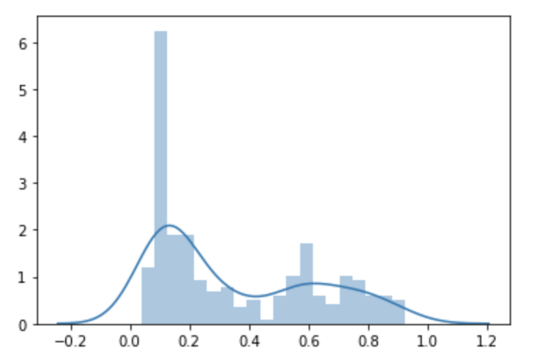

# Response for Class on 7/22

## Question 1: What is a one-hot-encoded column and why might it be needed when transforming a feature?  Are the source values continuous or discrete?

### Answer: 
  The source values are discrete. A one hot encoded column is where the integer encoded variable is removed and is replaced with a new binary variable (0s and 1s). This allows categorial data to be used and actually expressed as the labels are changed into numbers.

## Question 2: What is a dense feature?  For example, if you execute example = dict(dftrain) and then tf.keras.layers.DenseFeatures(your_features)(your_object).numpy(), how has the content of your data frame been transformed?  Why might this be useful?

### Answer:
  A dense feature shows the incomplete and complete data. For the incomplete data the value of 0 is given throughout the entire dataset. The model is now able to train on a complete set instead of figuring out how to process unknown data.
  
## Question 3: Provide a histogram of the probabilities for the logistic regression as well as your boosted tree model.  How do you interpret the two different models?  Are their predictions essentially the same or is there some area where they are noticeable different.  Plot the probability density function of the resulting probability predictions from the two models and use them to further illustrate your argument.  Include the ROC plot and interpret it with regard to the proportion of true to false positive rates, as well as the area under the ROC curve.  How does the measure of the AUC reflect upon the predictive power of your model?

### Answer:
  When looking at Logistical Regression compared to Boosted Tree the graphs show that the Boosted tree model will predict someone would not have survived slightly more often than the Logistical Regression. However, both models overall are similar to each other.
  
  ### Boosted Tree
  
  
  
  Density Function 
  
  
  
  ### Logistical Regression
  
  
  
  Density Function
  
  
  
  The ROC shows that the model is okay, there could definitely be some improvements, but it is not a bad model. The best model would be one that went straight up the left side of the graph at zero then across the top of the graph at 1. If a graph just had a 45-degree angle line that would be a very bad model as the model would be no more accurate than a person guessing between two options. The more area that there is under a curve (AUC), the better the model is performing.
  
  
  
## Question 4: Upload your feature values contribution to predicted probability horizontal bar plot as well as your violin plot.  Interpret and discuss the two plots.  Which features appear to contribute the most to the predicted probability?

### Answer:
  I changed the ID to look at the data from someone at idx 110. The individual was lucky and appeared to have a lot of feature characteristics working in their favor. The two most influential feature appear to be class and sex, as the individual was a second-class, female. 
  
  
  
  
## Question 5: Upload at least 2 feature importance plots.  Which features are the most important in their contribution to your models predictive power?

### Answer:
  The most important feature when it came to the model’s predication was clearly the gender of the individual. The second most important I am not completely sure how to interpret because it does appear to be between fare and class which rationally thinking about it makes sense with the real world implications and the discrimination that takes place on the basis of social-economic class divides.
  
  
  
