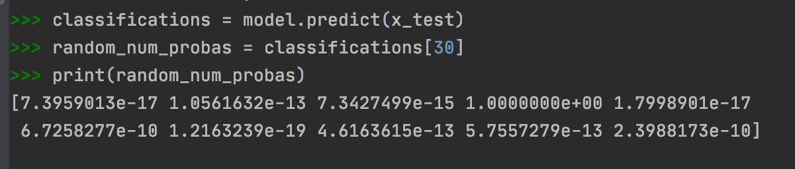
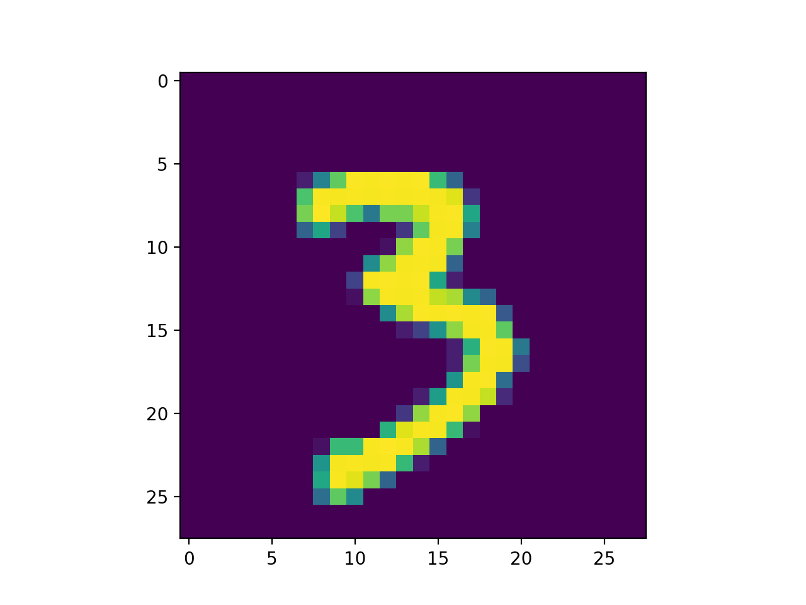
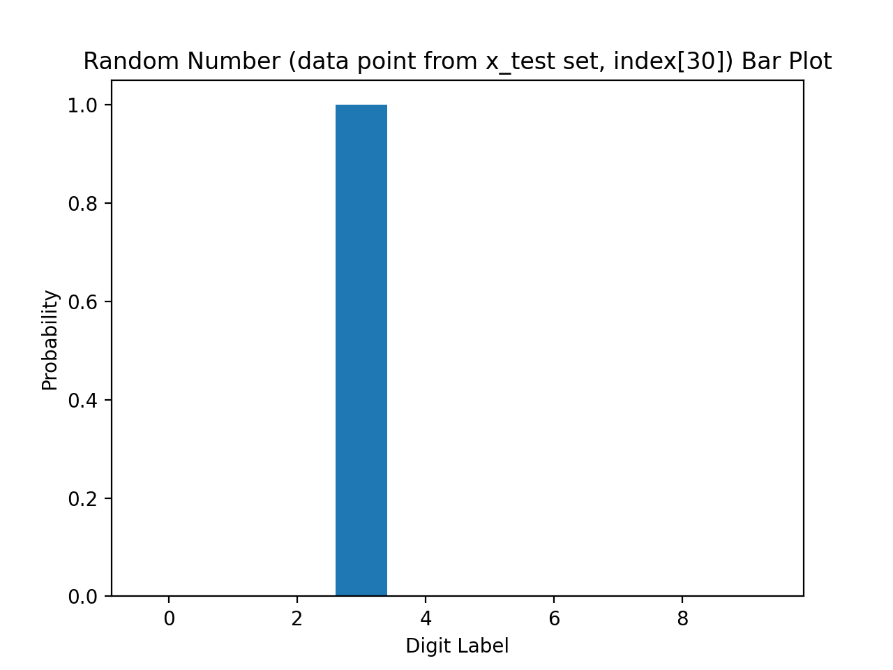

# Response for Class on 7/8

## Question 1: 
### In the video, First steps in computer vision, Laurence Maroney introduces us to the Fashion MNIST data set and using it to train a neural network in order to teach a computer “how to see.”  One of the first steps towards this goal is splitting the data into two groups, a set of training images and training labels and then also a set of test images and test labels.  Why is this done?  What is the purpose of splitting the data into a training set and a test set?

### Answer:
  You split your data into training and testing sets in order to teach your neural network. The training set allows the neural network to understand the rules that causes an object to be identified as a specific label and different from other labels i.e. what makes a shirt qualified/identifiable as a shirt and not a pair of pants. This is achieved by data in the form of an image being entered into pixels and then the neural network being able to recognize what data is in the pixels. Then, once the neural network has learned the rules in identifying the images/data with specific labels it is then introduced to data that it has never seen before, this is the testing data. There would be no point in testing the networks knowledge on all of the data because it has already seen the data and you told it what it was labeled as, it would be like pointing at a shirt, telling a person that it is a shirt, then asking them what type of clothing the apparel is.
  
## Question 2:
### The fashion MNIST example has increased the number of layers in our neural network from 1 in the past example, now to 3.  The last two are .Dense layers that have activation arguments using the relu and softmax functions.  What is the purpose of each of these functions.  Also, why are there 10 neurons in the third and last layer in the neural network.

### Answer:
  The purpose of the relu function is that is sets all of the outputs that are negative to zero. This is done so that the overall results are not skewed or pulled to the left (decreased). If there are negative results, then that could cause other positive results to be negated which would result in the skew. The softmax function finds the most candidate/ label for the data by setting the largest probability to one and the rest to zero. Instead of going through and comparing probabilities to different labels and finding the largest, now the network just has to find the one. There are 10 neurons in the last layer of the neural network because there are 10 labels that the data could be labeled.
  
## Question 3:
### In the past example we used the optimizer and loss function, while in this one we are using the function adam in the optimizer argument and sparse_categorical-crossentropy for the loss argument.  How do the optimizer and loss functions operate to produce model parameters (estimates) within the model.compile() function?

### Answer:
  The optimizer function repeatedly adjusts the values in the pixels. As this is done overtime the values in the training data become more accurately fitted to the labels.   The loss function is used in order to calculate how good or how bad an answer is. The answer being evaluated by the loss function comes from the sum value across pixels.   Sparse_categorical_crossentropy loss function is used because what is being predicted here are categories.
  
## Question 4:
### Using the mnist drawings dataset (the dataset with the hand written numbers with corresponding labels) answer the following questions.

### - What is the shape of the images training set (how many and the dimension of each)?

### Answer:
  There are 50,000 images in the training set in 28 by 28 dimension.

### - What is the length of the labels training set?

### Answer:
  The length of the labels is 10 to correspond with options 0-9.

### - What is the shape of the images test set?

### Answer:
  There are 10,000 images in the test set in 28 by 28 dimensions.
  
### - Estimate a probability model and apply it to the test set in order to produce the array of probabilities that a randomly selected image is each of the possible numeric outcomes (look towards the end of the basic image classification exercises for how to do this — you can apply the same method applied to the Fashion MNIST dataset but now apply it to the hand written letters MNIST dataset).

### Answer: 
  Probability model for image/data at index 30 in the x_test set. The random digit had the highest probability that it is a label four. 
  
  
### - Use np.argmax() with your predictions object to return the numeral with the highest probability from the test labels dataset.

### Answer:
  The digit "3" corresponds with the fourth label, which is the label with the highest probability to represent the image at index 30.

### - Produce the following plot for your randomly selected image from the test dataset.

### Answer:
        
